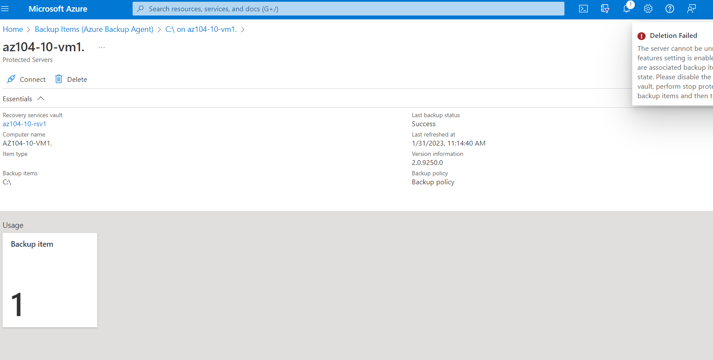

# Laboratorio 10 - Copia de seguridad de máquinas virtuales

## Escenario de laboratorio
Se le asignó la tarea de evaluar el uso de Azure Recovery Services para realizar copias de seguridad y restaurar archivos alojados en máquinas virtuales de Azure y equipos locales. Además, desea identificar métodos para proteger los datos almacenados en el almacén de Recovery Services contra pérdidas de datos accidentales o maliciosas.

Nota: Hay disponible una simulación de laboratorio interactiva que le permite hacer clic en este laboratorio a su propio ritmo. Es posible que encuentre ligeras diferencias entre la simulación interactiva y el laboratorio alojado, pero los conceptos e ideas centrales que se demuestran son los mismos.

## Objetivos
En este laboratorio, usted:

- Tarea 1: Aprovisionar el entorno de laboratorio
- Tarea 2: crear un almacén de servicios de recuperación
- Tarea 3: implementar una copia de seguridad a nivel de máquina virtual de Azure
- Tarea 4: Implementar la copia de seguridad de archivos y carpetas
- Tarea 5: realizar la recuperación de archivos mediante el agente de Azure Recovery Services
- Tarea 6: realizar la recuperación de archivos mediante instantáneas de máquinas virtuales de Azure (opcional)
- Tarea 7: revisar la funcionalidad de eliminación temporal de Azure Recovery Services (opcional)

## Tiempo estimado: 50 minutos
## Diagrama de arquitectura


## Instrucciones
### Ejercicio 1
### Tarea 1: Aprovisionar el entorno de laboratorio
En esta tarea, implementará dos máquinas virtuales que se utilizarán para probar diferentes escenarios de copia de seguridad.

1. Inicie sesión en el portal de Azure .

2. En Azure Portal, abra Azure Cloud Shell haciendo clic en el icono en la parte superior derecha de Azure Portal.

3. Si se le solicita que seleccione Bash o PowerShell , seleccione PowerShell .

**Nota :** si es la primera vez que inicia Cloud Shell y aparece el mensaje No tiene almacenamiento montado , seleccione la suscripción que está usando en este laboratorio y haga clic en Crear almacenamiento .

4. En la barra de herramientas del panel de Cloud Shell, haga clic en el ícono Cargar/Descargar archivos , en el menú desplegable, haga clic en Cargar y cargue los archivos \Allfiles\Labs\10\az104-10-vms-edge-template.json y \ Allfiles\Labs\10\az104-10-vms-edge-parameters.json en el directorio principal de Cloud Shell.

5. Edite el archivo de parámetros que acaba de cargar y cambie la contraseña. Si necesita ayuda para editar el archivo en el Shell, solicite ayuda a su instructor. Como práctica recomendada, los secretos, como las contraseñas, deben almacenarse de forma más segura en Key Vault.

6. Desde el panel de Cloud Shell, ejecute lo siguiente para crear el grupo de recursos que hospedará las máquinas virtuales (reemplace el [Azure_region]marcador de posición con el nombre de una región de Azure donde pretende implementar máquinas virtuales de Azure). Escriba cada línea de comando por separado y ejecútelas por separado:

```
$location = '[Azure_region]'
```
```
$rgName = 'az104-10-rg0'
```
```
New-AzResourceGroup -Name $rgName -Location $location
```


7. Desde el panel de Cloud Shell, ejecute lo siguiente para crear la primera red virtual e implementar una máquina virtual en ella usando la plantilla y los archivos de parámetros que cargó:

```
New-AzResourceGroupDeployment `
   -ResourceGroupName $rgName `
   -TemplateFile $HOME/az104-10-vms-edge-template.json `
   -TemplateParameterFile $HOME/az104-10-vms-edge-parameters.json `
   -AsJob
```
8. Minimice Cloud Shell (pero no lo cierre).

**Nota :** no espere a que se complete la implementación, sino que continúe con la siguiente tarea. La implementación debería tardar unos 5 minutos.

### Tarea 2: crear un almacén de servicios de recuperación
En esta tarea, creará un almacén de servicios de recuperación.

1. En Azure Portal, busque y seleccione bóvedas de Recovery Services y, en la hoja de bóvedas de Recovery Services , haga clic en + Crear .

2. En la hoja del almacén Create Recovery Services , especifique la siguiente configuración:

| Ajustes | Valor |
| -- | -- |
| Suscripción | el nombre de la suscripción de Azure que está utilizando en este laboratorio |
| grupo de recursos | el nombre de un nuevo grupo de recursos az104-10-rg1 |
| Nombre de la bóveda | az104-10-rsv1 |
| Región | el nombre de una región donde implementó las dos máquinas virtuales en la tarea anterior |
| | |

**Nota :** asegúrese de especificar la misma región en la que implementó las máquinas virtuales en la tarea anterior.

3. Haga clic en Revisar + Crear , asegúrese de que la validación haya pasado y haga clic en Crear .


**Nota :** Espere a que se complete la implementación. La implementación debe tomar menos de 1 minuto.

4. Cuando se complete la implementación, haga clic en Ir al recurso .


5. En la hoja del almacén de servicios de recuperación az104-10-rsv1 , en la sección Configuración , haga clic en Propiedades .

6. En la hoja az104-10-rsv1 - Propiedades , haga clic en el vínculo Actualizar en la etiqueta Configuración de copia de seguridad .


7. En la hoja Configuración de copia de seguridad , tenga en cuenta que puede configurar el Tipo de replicación de almacenamiento en Redundancia local o Redundancia geográfica . Deje la configuración predeterminada de Redundancia geográfica en su lugar y cierre la hoja.

**Nota :** esta configuración solo se puede configurar si no hay elementos de copia de seguridad existentes.

8. De vuelta en la hoja az104-10-rsv1 - Propiedades , haga clic en el vínculo Actualizar debajo de la etiqueta Configuración de seguridad .

9. En la hoja Configuración de seguridad , tenga en cuenta que Eliminación temporal (para cargas de trabajo que se ejecutan en Azure) está Habilitado .


10. Cierre la hoja Configuración de seguridad y, de nuevo en la hoja del almacén de servicios de recuperación az104-10-rsv1 , haga clic en Información general .

### Tarea 3: implementar una copia de seguridad a nivel de máquina virtual de Azure
En esta tarea, implementará la copia de seguridad a nivel de máquina virtual de Azure.

**Nota :** antes de comenzar esta tarea, asegúrese de que la implementación que inició en la primera tarea de este laboratorio se haya completado correctamente.

1. En el blade de bóveda de servicios de recuperación az104-10-rsv1 , haga clic en Información general y, a continuación, haga clic en + Copia de seguridad .

2. En la hoja Backup Goal , especifique la siguiente configuración:

| Ajustes |	Valor |
| -- | -- |
| ¿Dónde se está ejecutando su carga de trabajo? |	Azur |
| ¿Qué quieres respaldar? | Máquina virtual |
| | |

3. En la hoja Objetivo de copia de seguridad , haga clic en Copia de seguridad .

4. En la política de copia de seguridad , revise la configuración de la política predeterminada y seleccione Crear una nueva política .


5. Defina una nueva política de copias de seguridad con las siguientes configuraciones (deje las demás con sus valores predeterminados):

| Configuración |	Valor |
| -- | -- |
| Nombre de directiva | az104-10-directiva-de-copia de seguridad |
| Frecuencia | A diario |
| Tiempo | 12:00 A.M |
| Zona horaria | el nombre de su zona horaria local |
| Conserve las instantáneas de recuperación instantánea para | 2 días |
| | |

6. Haga clic en Aceptar para crear la política y luego, en la sección Máquinas virtuales , seleccione Agregar .


7. En la hoja Seleccionar máquinas virtuales , seleccione az-104-10-vm0 , haga clic en Aceptar y, de nuevo en la hoja Copia de seguridad , haga clic en Habilitar copia de seguridad .

**Nota :** Espere a que se habilite la copia de seguridad. Esto debería tomar alrededor de 2 minutos.

8. Vuelva a la hoja del almacén de servicios de recuperación az104-10-rsv1 , en la sección Elementos protegidos , haga clic en Elementos de copia de seguridad y, a continuación, haga clic en la entrada de la máquina virtual de Azure .

9. En la hoja Elementos de copia de seguridad (Máquina virtual de Azure), seleccione el vínculo Ver detalles para az104-10-vm0 y revise los valores de las entradas Comprobación previa de la copia de seguridad y Estado de la última copia de seguridad .

10. En la hoja Elemento de copia de seguridad az104-10-vm0 , haga clic en Copia de seguridad ahora , acepte el valor predeterminado en la lista desplegable Conservar copia de seguridad hasta y haga clic en Aceptar .


**Nota :** no espere a que se complete la copia de seguridad, sino que continúe con la siguiente tarea.

### Tarea 4: Implementar la copia de seguridad de archivos y carpetas
En esta tarea, implementará la copia de seguridad de archivos y carpetas mediante Azure Recovery Services.

1. En Azure Portal, busque y seleccione Máquinas virtuales y, en la hoja Máquinas virtuales , haga clic en az104-10-vm1 .

2. En la hoja az104-10-vm1 , haga clic en Conectar , en el menú desplegable, haga clic en RDP , en la hoja Conectar con RDP , haga clic en Descargar archivo RDP y siga las indicaciones para iniciar la sesión de Escritorio remoto.


**Nota :** este paso se refiere a la conexión a través de Escritorio remoto desde una computadora con Windows. En una Mac, puede usar Remote Desktop Client desde Mac App Store y en computadoras Linux puede usar un software de cliente RDP de código abierto.

**Nota :** puede ignorar cualquier mensaje de advertencia al conectarse a las máquinas virtuales de destino.

3. Cuando se le solicite, inicie sesión con el nombre de usuario y la contraseña del estudiante del archivo de parámetros.

**Nota :** Debido a que Azure Portal ya no es compatible con IE11, deberá usar Microsoft Edge Browser para esta tarea.

4. Dentro de la sesión de Escritorio remoto en la máquina virtual Azure az104-10-vm1 , inicie un navegador web Edge, navegue hasta Azure Portal e inicie sesión con sus credenciales.


5. En Azure Portal, busque y seleccione bóvedas de Recovery Services y, en las bóvedas de Recovery Services , haga clic en az104-10-rsv1 .

6. En la hoja del almacén de servicios de recuperación az104-10-rsv1 , haga clic en + Copia de seguridad .

7. En la hoja Backup Goal , especifique la siguiente configuración:

| Ajustes |	Valor |
| -- | -- |
| ¿Dónde se está ejecutando su carga de trabajo? |	En las instalaciones |
| ¿Qué quieres respaldar?	| Archivos y carpetas |
| | |

**Nota :** aunque la máquina virtual que está utilizando en esta tarea se ejecuta en Azure, puede aprovecharla para evaluar las capacidades de copia de seguridad aplicables a cualquier equipo local que ejecute el sistema operativo Windows Server.

8. En la hoja Objetivo de copia de seguridad , haga clic en Preparar infraestructura .

9. En la hoja Preparar infraestructura , haga clic en el enlace Descargar agente para Windows Server o Windows Client .

10. Cuando se le solicite, haga clic en Ejecutar para iniciar la instalación de MARSAgentInstaller.exe con la configuración predeterminada.


**Nota :** en la página de suscripción de Microsoft Update del asistente de configuración del agente de Microsoft Azure Recovery Services , seleccione la opción de instalación No deseo usar Microsoft Update .

11. En la página Instalación del Asistente de configuración del agente de Microsoft Azure Recovery Services , haga clic en Continuar con el registro . Esto iniciará el asistente de registro del servidor .

12. Cambie a la ventana del navegador web que muestra Azure Portal, en la hoja Preparar infraestructura , seleccione la casilla de verificación Ya descargado o utilizando el agente del servidor de recuperación más reciente y haga clic en Descargar .

13. Cuando se le solicite si desea abrir o guardar el archivo de credenciales del almacén, haga clic en Guardar . Esto guardará el archivo de credenciales de la bóveda en la carpeta Descargas local.

14. Vuelva a la ventana del Asistente de registro del servidor y, en la página Identificación de la bóveda , haga clic en Examinar .

15. En el cuadro de diálogo Seleccionar credenciales de la bóveda , vaya a la carpeta Descargas , haga clic en el archivo de credenciales de la bóveda que descargó y haga clic en Abrir .

16. De vuelta en la página Identificación de la bóveda , haga clic en Siguiente .

17. En la página Configuración de cifrado del Asistente de servidor de registro , haga clic en Generar frase de contraseña .

18. En la página Configuración de cifrado del Asistente de registro del servidor , haga clic en el botón Examinar junto a Ingresar una ubicación para guardar la frase de contraseña .

19. En el cuadro de diálogo Buscar carpeta , seleccione la carpeta Documentos y haga clic en Aceptar .

20. Haga clic en Finalizar , revise la advertencia de Microsoft Azure Backup y haga clic en Sí , y espere a que se complete el registro.


**Nota :** en un entorno de producción, debe almacenar el archivo de frase de contraseña en una ubicación segura que no sea el servidor del que se está realizando la copia de seguridad.

21. En la página de registro del servidor del asistente de registro del servidor , revise la advertencia sobre la ubicación del archivo de frase de contraseña, asegúrese de que la casilla de verificación Iniciar el agente de servicios de recuperación de Microsoft Azure esté seleccionada y haga clic en Cerrar . Esto abrirá automáticamente la consola de Microsoft Azure Backup .


22. En la consola de Microsoft Azure Backup , en el panel Acciones , haga clic en Programar copia de seguridad .

23. En el Asistente para programar copia de seguridad , en la página Introducción , haga clic en Siguiente .

24. En la página Seleccionar elementos para respaldar , haga clic en Agregar elementos .

25. En el cuadro de diálogo Seleccionar elementos , expanda C:\Windows\System32\drivers\etc\ , seleccione hosts y luego haga clic en Aceptar :


26. En la página Seleccionar elementos para respaldar , haga clic en Siguiente .

27. En la página Especificar programa de respaldo , asegúrese de que la opción Día esté seleccionada, en el primer cuadro de lista desplegable debajo del cuadro A las siguientes horas (el máximo permitido es tres veces al día) , seleccione 4:30 AM y luego haga clic en Siguiente .

28. En la página Seleccionar política de retención , acepte los valores predeterminados y luego haga clic en Siguiente .

29. En la página Elegir el tipo de copia de seguridad inicial , acepte los valores predeterminados y luego haga clic en Siguiente .

30. En la página Confirmación , haga clic en Finalizar . Cuando se crea la programación de la copia de seguridad, haga clic en Cerrar .


31. En la consola de Microsoft Azure Backup , en el panel Acciones, haga clic en Hacer copia de seguridad ahora .

**Nota :** la opción de ejecutar una copia de seguridad bajo demanda está disponible una vez que crea una copia de seguridad programada.

32. En el Asistente para realizar una copia de seguridad ahora, en la página Seleccionar elemento de copia de seguridad , asegúrese de que la opción Archivos y carpetas esté seleccionada y haga clic en Siguiente .

33. En la página Conservar copia de seguridad hasta , acepte la configuración predeterminada y haga clic en Siguiente .

34. En la página Confirmación , haga clic en Copia de seguridad .

35. Cuando se complete la copia de seguridad, haga clic en Cerrar y luego cierre Microsoft Azure Backup.

36. Cambie a la ventana del navegador web que muestra Azure Portal, vuelva a la hoja del almacén de Recovery Services , en la sección Elementos protegidos y haga clic en Elementos de copia de seguridad .

37. En la hoja az104-10-rsv1 - Elementos de copia de seguridad , haga clic en Azure Backup Agent .

38. En la hoja Elementos de copia de seguridad (agente de copia de seguridad de Azure) , verifique que haya una entrada que haga referencia a la unidad C:\ de az104-10-vm1.


### Tarea 5: realizar la recuperación de archivos mediante el agente de Azure Recovery Services (opcional)
En esta tarea, realizará la restauración de archivos mediante el agente de Azure Recovery Services.

1. Dentro de la sesión de Escritorio remoto a az104-10-vm1 , abra el Explorador de archivos, vaya a la carpeta C:\Windows\System32\drivers\etc\ y elimine el archivo hosts .

2. Abra Microsoft Azure Backup y haga clic en Recuperar datos en el panel Acciones . Esto iniciará el Asistente para la recuperación de datos .

3. En la página Introducción del Asistente para la recuperación de datos , asegúrese de que la opción Este servidor (az104-10-vm1.) esté seleccionada y haga clic en Siguiente .

4. En la página Seleccionar modo de recuperación , asegúrese de que la opción Archivos y carpetas individuales esté seleccionada y haga clic en Siguiente .

5. En la página Seleccionar volumen y fecha , en la lista desplegable Seleccionar el volumen , seleccione C:\ , acepte la selección predeterminada de la copia de seguridad disponible y haga clic en Montar .

**Nota :** Espere a que se complete la operación de montaje. Esto puede tardar unos 2 minutos.

6. En la página Examinar y recuperar archivos , anote la letra de la unidad del volumen de recuperación y revise la sugerencia sobre el uso de robocopy.

7. Haga clic en Inicio , expanda la carpeta Sistema de Windows y haga clic en Símbolo del sistema .

8. Desde el símbolo del sistema, ejecute lo siguiente para copiar el archivo de restauración de hosts a la ubicación original (reemplace [recovery_volume]con la letra de la unidad del volumen de recuperación que identificó anteriormente):

```
robocopy [recovery_volume]:\Windows\System32\drivers\etc C:\Windows\system32\drivers\etc hosts /r:1 /w:1
```


9. Vuelva al Asistente de recuperación de datos y, en Examinar y recuperar archivos , haga clic en Desmontar y, cuando se le solicite que confirme, haga clic en Sí .

10. Finalice la sesión de Escritorio remoto.

### Tarea 6: realizar la recuperación de archivos mediante instantáneas de máquinas virtuales de Azure (opcional)
En esta tarea, restaurará un archivo desde la copia de seguridad basada en instantáneas a nivel de máquina virtual de Azure.

1. Cambie a la ventana del navegador que se ejecuta en su computadora de laboratorio y muestra Azure Portal.

2. En Azure Portal, busque y seleccione Máquinas virtuales y, en la hoja Máquinas virtuales , haga clic en az104-10-vm0 .

3. En la hoja az104-10-vm0 , haga clic en Conectar , en el menú desplegable, haga clic en RDP , en la hoja Conectar con RDP , haga clic en Descargar archivo RDP y siga las indicaciones para iniciar la sesión de Escritorio remoto.

**Nota :** este paso se refiere a la conexión a través de Escritorio remoto desde una computadora con Windows. En una Mac, puede usar Remote Desktop Client desde Mac App Store y en computadoras Linux puede usar un software de cliente RDP de código abierto.

**Nota :** puede ignorar cualquier mensaje de advertencia al conectarse a las máquinas virtuales de destino.

Cuando se le solicite, inicie sesión con el nombre de usuario y la contraseña del estudiante del archivo de parámetros.

**Nota :** Debido a que Azure Portal ya no es compatible con IE11, deberá usar Microsoft Edge Browser para esta tarea.

4. Dentro de la sesión de Escritorio remoto a az104-10-vm0 , haga clic en Inicio , expanda la carpeta Sistema de Windows y haga clic en Símbolo del sistema .

5. Desde el símbolo del sistema, ejecute lo siguiente para eliminar el archivo de hosts :

```
del C:\Windows\system32\drivers\etc\hosts
```


**Nota :** restaurará este archivo desde la copia de seguridad basada en instantáneas a nivel de máquina virtual de Azure más adelante en esta tarea.

6. Dentro de la sesión de Escritorio remoto en la máquina virtual Azure az104-10-vm0 , inicie un navegador web Edge, navegue hasta Azure Portal e inicie sesión con sus credenciales.


7. En Azure Portal, busque y seleccione bóvedas de Recovery Services y, en las bóvedas de Recovery Services , haga clic en az104-10-rsv1 .

8. En la hoja del almacén de servicios de recuperación az104-10-rsv1 , en la sección Elementos protegidos , haga clic en Elementos de copia de seguridad .

9. En la hoja az104-10-rsv1 - Elementos de copia de seguridad , haga clic en Azure Virtual Machine .

10. En la hoja Elementos de copia de seguridad (Máquina virtual de Azure) , seleccione Ver detalles de az104-10-vm0 .

11. En la hoja Elemento de copia de seguridad az104-10-vm0 , haga clic en Recuperación de archivos .


**Nota :** tiene la opción de ejecutar la recuperación poco después de que comience la copia de seguridad en función de la instantánea coherente de la aplicación.

12. En la hoja Recuperación de archivos , acepte el punto de recuperación predeterminado y haga clic en Descargar ejecutable .

**Nota :** la secuencia de comandos monta los discos desde el punto de recuperación seleccionado como unidades locales dentro del sistema operativo desde el que se ejecuta la secuencia de comandos.

13. Haga clic en Descargar y, cuando se le solicite ejecutar o guardar IaaSVMILRExeForWindows.exe , haga clic en Guardar .

14. De vuelta en la ventana del Explorador de archivos, haga doble clic en el archivo recién descargado.

15. Cuando se le solicite que proporcione la contraseña del portal, copie la contraseña del cuadro de texto Contraseña para ejecutar el script en la hoja Recuperación de archivos , péguela en el símbolo del sistema y presione Entrar .


**Nota :** Esto abrirá una ventana de Windows PowerShell que muestra el progreso del montaje.

**Nota :** si recibe un mensaje de error en este punto, actualice la ventana del navegador web y repita los últimos tres pasos.

16. Espere a que se complete el proceso de montaje, revise los mensajes informativos en la ventana de Windows PowerShell, anote la letra de la unidad asignada al volumen que aloja Windows e inicie el Explorador de archivos.

17. En el Explorador de archivos, navegue hasta la letra de la unidad que aloja la instantánea del volumen del sistema operativo que identificó en el paso anterior y revise su contenido.

18. Cambie a la ventana del símbolo del sistema .


19. Desde el símbolo del sistema, ejecute lo siguiente para copiar el archivo de restauración de hosts a la ubicación original (reemplace [os_volume]con la letra de la unidad del volumen del sistema operativo que identificó anteriormente):

```
robocopy [os_volume]:\Windows\System32\drivers\etc C:\Windows\system32\drivers\etc hosts /r:1 /w:1
```


20. Vuelva a la hoja Recuperación de archivos en Azure Portal y haga clic en Desmontar discos .

21. Finalice la sesión de Escritorio remoto.

### Tarea 7: revisar la funcionalidad de eliminación temporal de Azure Recovery Services

1. En el equipo de laboratorio, en Azure Portal, busque y seleccione los almacenes de Recovery Services y, en los almacenes de Recovery Services , haga clic en az104-10-rsv1 .

2. En la hoja del almacén de servicios de recuperación az104-10-rsv1 , en la sección Elementos protegidos , haga clic en Elementos de copia de seguridad .

3. En la hoja az104-10-rsv1 - Elementos de copia de seguridad , haga clic en Azure Backup Agent .

4. En la hoja Elementos de copia de seguridad (agente de copia de seguridad de Azure) , haga clic en la entrada que representa la copia de seguridad de az104-10-vm1 .

5. En C:\ en az104-10-vm1. hoja, seleccione Ver detalles para az104-10-vm1. .

6. En la hoja Detalle, haga clic en az104-10-vm1 .

7. En el az104-10-vm1. hoja Servidores protegidos, haga clic en Eliminar .

8. En la hoja Eliminar , especifique la siguiente configuración.

| Ajustes |	Valor |
| -- | -- |
| ESCRIBE EL NOMBRE DEL SERVIDOR | az104-10-vm1. |
| Razón	 | Servidor de desarrollo/prueba de reciclaje |
| Comentarios | az104 10 laboratorio |
| | |

**Nota :** asegúrese de incluir el punto final al escribir el nombre del servidor

9. Active la casilla de verificación junto a la etiqueta Hay datos de copia de seguridad de 1 elementos de copia de seguridad asociados con este servidor. Entiendo que al hacer clic en "Confirmar" se eliminarán permanentemente todos los datos de la copia de seguridad en la nube. Esta acción no se puede deshacer. Es posible que se envíe una alerta a los administradores de esta suscripción notificándoles esta eliminación y haga clic en Eliminar .

**Nota :** Esto fallará porque la función de eliminación temporal debe estar deshabilitada.



10. Vuelva a la hoja az104-10-rsv1 - Elementos de copia de seguridad y haga clic en Azure Virtual Machines .

11. En la hoja az104-10-rsv1 - Elementos de copia de seguridad , haga clic en Azure Virtual Machine .

12. En la hoja Elementos de copia de seguridad (Máquina virtual de Azure) , seleccione Ver detalles de az104-10-vm0 .

13. En la hoja Elemento de copia de seguridad az104-10-vm0 , haga clic en Detener copia de seguridad .

14. En la hoja Detener copia de seguridad , seleccione Eliminar datos de copia de seguridad , especifique la siguiente configuración y haga clic en Detener copia de seguridad :

| Ajustes |	Valor |
| -- | -- |
| Escriba el nombre del elemento de copia de seguridad |	az104-10-vm0 |
| Razón | Otros |
| Comentarios | az104 10 laboratorio |
| | |

15. Vuelva a la hoja az104-10-rsv1 - Elementos de copia de seguridad y haga clic en Actualizar .

**Nota :** la entrada de la máquina virtual de Azure sigue enumerando 1 elemento de copia de seguridad.

16. Haga clic en la entrada Máquina virtual de Azure y, en la hoja Elementos de copia de seguridad (Máquina virtual de Azure) , haga clic en la entrada az104-10-vm0 .

17. En la hoja Elemento de copia de seguridad az104-10-vm0 , tenga en cuenta que tiene la opción de Recuperar la copia de seguridad eliminada.

**Nota :** esta funcionalidad la proporciona la función de eliminación temporal, que está, de forma predeterminada, habilitada para las copias de seguridad de máquinas virtuales de Azure.

18. Vuelva a la hoja de bóveda de servicios de recuperación az104-10-rsv1 y, en la sección Configuración , haga clic en Propiedades .

19. En la hoja az104-10-rsv1 - Propiedades , haga clic en el vínculo Actualizar en la etiqueta Configuración de seguridad .

20. En la hoja Configuración de seguridad , deshabilite la eliminación temporal (para las cargas de trabajo que se ejecutan en Azure) y también deshabilite las características de seguridad (para las cargas de trabajo que se ejecutan en las instalaciones) y haga clic en Guardar .

**Nota :** Esto no afectará a los elementos que ya están en estado de eliminación temporal.

21. Cierre la hoja Configuración de seguridad y, de nuevo en la hoja del almacén de servicios de recuperación az104-10-rsv1 , haga clic en Información general .

22. Vuelva a la hoja Elemento de copia de seguridad az104-10-vm0 y haga clic en Recuperar .

23. En la hoja Recuperar az104-10-vm0 , haga clic en Recuperar .

24. Espere a que se complete la operación de recuperación, actualice la página del navegador web, si es necesario, vuelva a la hoja Elemento de copia de seguridad az104-10-vm0 y haga clic en Eliminar datos de copia de seguridad .


25. En la hoja Eliminar datos de copia de seguridad , especifique la siguiente configuración y haga clic en Eliminar :

| Ajustes | Valor |
| -- | -- |
| Escriba el nombre del elemento de copia de seguridad |	az104-10-vm0 |
| Razón | Otros |
| Comentarios | az104 10 laboratorio |
| | |

26. Repita los pasos al comienzo de esta tarea para eliminar los elementos de respaldo para az104-10-vm1 .

#### Limpiar recursos
**Nota :** Recuerde eliminar cualquier recurso de Azure recién creado que ya no use. La eliminación de los recursos no utilizados garantiza que no verá cargos inesperados.

**Nota :** no se preocupe si los recursos del laboratorio no se pueden eliminar de inmediato. A veces, los recursos tienen dependencias y tardan más en eliminarse. Supervisar el uso de recursos es una tarea común del administrador, así que revise periódicamente sus recursos en el Portal para ver cómo va la limpieza.

1. En Azure Portal, abra la sesión de PowerShell dentro del panel de Cloud Shell .

2. Enumere todos los grupos de recursos creados en los laboratorios de este módulo ejecutando el siguiente comando:

```
Get-AzResourceGroup -Name 'az104-10*'
```

Elimine todos los grupos de recursos que creó en los laboratorios de este módulo ejecutando el siguiente comando:
```
Get-AzResourceGroup -Name 'az104-10*' | Remove-AzResourceGroup -Force -AsJob
```

**Nota :** Opcionalmente, puede considerar eliminar el grupo de recursos generado automáticamente con el prefijo AzureBackupRG_ (no hay ningún cargo adicional asociado con su existencia).

**Nota :** el comando se ejecuta de forma asincrónica (según lo determinado por el parámetro -AsJob), por lo que, aunque podrá ejecutar otro comando de PowerShell inmediatamente después dentro de la misma sesión de PowerShell, pasarán unos minutos antes de que se eliminen realmente los grupos de recursos.

### Revisar
En este laboratorio, usted tiene:

- Aprovisionó el entorno de laboratorio
- Creó una bóveda de servicios de recuperación
- Copia de seguridad a nivel de máquina virtual de Azure implementada
- Copia de seguridad de archivos y carpetas implementada
- Recuperación de archivos realizada mediante el agente de Azure Recovery Services
- Recuperación de archivos realizada mediante el uso de instantáneas de máquinas virtuales de Azure
- Se revisó la funcionalidad de eliminación temporal de Azure Recovery Services